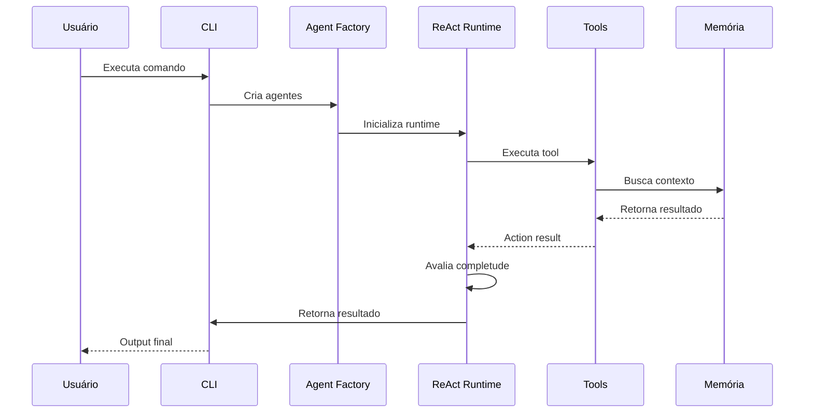

# ADR 001: Arquitetura Geral do Sistema CrewClaw

## 1. Status

**Aceito** - Implementado na versão 1.0.0

## 2. Contexto

O CrewClaw é um sistema de agentes autônomos com memória persistente local, projetado para:
- **Privacidade total**: Todos os dados permanecem no disco local
- **Execução autônoma**: Capacidade de executar tarefas em loop ReAct
- **Memória de longo prazo**: Vetorização e busca semântica com persistência Markdown

### Problema a Resolver

Sistemas de agentes AI tradicionais dependem de APIs externas e memória efêmera. Precisamos de uma solução que:
- Não dependa de serviços cloud para persistência
- Permita auditabilidade completa das "decisões" do agente
- Execute autonomamente com proteção contra loops infinitos

## 3. Decisões de Arquitetura

### 3.1 Stack Tecnológico

| Componente | Tecnologia | Justificativa |
|------------|------------|---------------|
| **Linguagem** | Python 3.10+ | Ecossistema CrewAI, flexibilidade |
| **Orquestrador** | CrewAI | Loop ReAct nativo, gestão de multi-agentes |
| **Banco Vetorial** | SQLite + sqlite-vec | Local-first, busca híbrida SQL+vetor |
| **Embeddings** | sentence-transformers (local) | Privacidade, sem API externa |
| **Persistência** | Arquivos Markdown | Auditabilidade humana |

### 3.2 Estrutura de Diretórios

```
crewclaw/
├── crewclaw/
│   ├── agents/          # Factory e definições de agentes
│   ├── tools/           # Ferramentas do sistema
│   ├── runtime/         # Executor ReAct
│   ├── config/          # Gestão de configuração
│   └── __init__.py
├── memory/              # Memória persistente (Markdown + SQLite)
├── config/              # Configurações YAML
├── logs/                # Logs de execução
└── docs/                # Documentação
```

### 3.3 Diagrama de Arquitetura

```mermaid
graph TB
    subgraph "Interface"
        CLI[CLI / API]
        MD[Arquivos Markdown]
    end

    subgraph "Core Engine"
        CF[Config Manager]
        AF[Agent Factory]
        RT[ReAct Runtime]
    end

    subgraph "Orquestração"
        AG[CrewAI Agents]
        CR[Crew Manager]
    end

    subgraph "Ferramentas"
        FR        FW[File Write]
        GR[Grep]
        WS[Web Search]
        SH[Shell[File Read]
]
    end

    subgraph "Memória"
        VS[(SQLite-vec)]
        MV[Markdown Files]
        MB[Memory Search]
    end

    CLI --> CF
    MD --> MB
    CF --> AF
    AF --> AG
    AG --> CR
    CR --> RT
    RT --> FR
    RT --> FW
    RT --> GR
    RT --> WS
    RT --> SH
    MB --> VS
    MB --> MV
```

### 3.4 Fluxo de Execução



## 4. Design de Componentes

### 4.1 Config Manager

- Singleton que carrega `crewclaw.json`
- Suporte a dot-notation (`runtime.max_iterations`)
- Variáveis de ambiente para override

### 4.2 Agent Factory

- Carrega agentes de `config/agents.yaml`
- Suporta injeção de tools customizadas
- Substituição de variáveis `{$var}` nos prompts

### 4.3 ReAct Runtime

- Loop autônomo com limite de iterações
- Watchdog para detectar loops infinitos
- Auto-correção em caso de erro

### 4.4 Memory System

- **Scope**: /agent, /project, /company
- **Busca híbrida**: FTS5 + vetor
- **Consolidação**: Resumo automático após N tarefas

## 5. Consequências

### 5.1 Vantagens

- **Privacidade**: Zero dependência de cloud
- **Auditabilidade**: Markdown legível por humanos
- **Flexibilidade**: Python + YAML + Markdown
- **Performance**: SQLite-vec é extremamente rápido

### 5.2 Limitações

- Instalação requer drivers SQLite
- Embeddings locais são mais lentos que API
- Não é distribuído (single-node)

## 6. Referências

- [ADR Template](https://github.com/joelparkerhenderson/architecture-decision-record)
- [CrewAI Documentation](https://docs.crewai.com/)
- [sqlite-vec](https://github.com/asg017/sqlite-vec)
