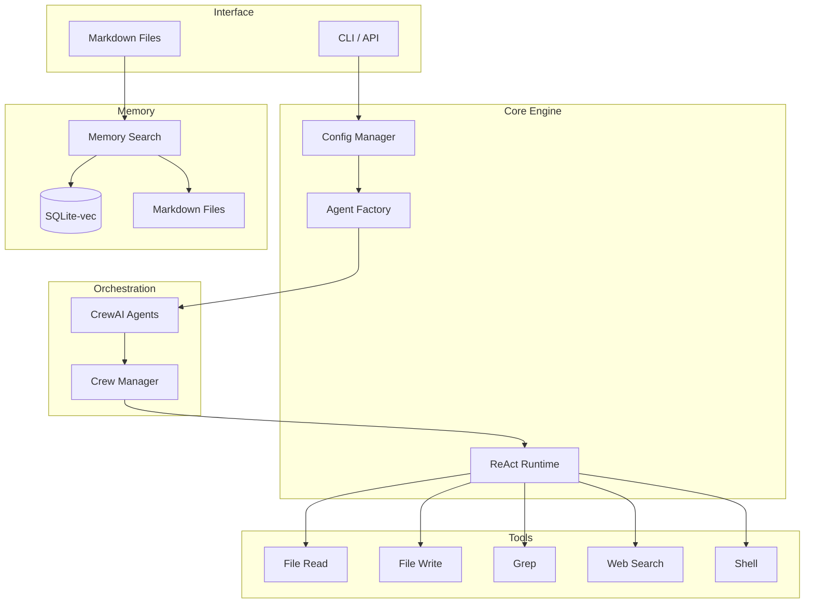
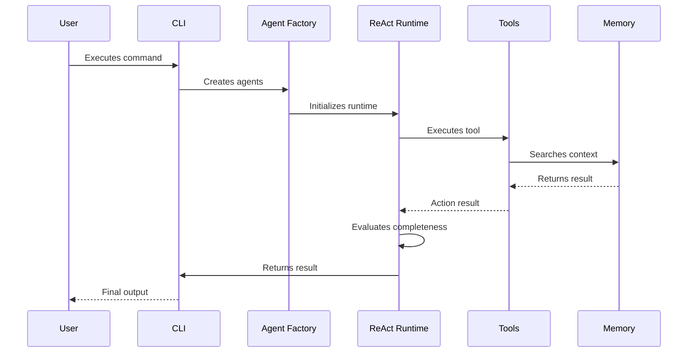

# ADR 001: General Architecture of the CrewClaw System

## 1. Status

**Accepted** - Implemented in version 1.0.0

## 2. Context

CrewClaw is an autonomous agent system with local persistent memory, designed for:
- **Total Privacy**: All data remains on the local disk.
- **Autonomous Execution**: Ability to execute tasks in a ReAct loop.
- **Long-term Memory**: Vectorization and semantic search with Markdown persistence.

### Problem to Solve

Traditional AI agent systems depend on external APIs and ephemeral memory. We need a solution that:
- Does not depend on cloud services for persistence.
- Allows full auditability of the agent's "decisions".
- Executes autonomously with protection against infinite loops.

## 3. Architecture Decisions

### 3.1 Technological Stack

| Component | Technology | Rationale |
|------------|------------|---------------|
| **Language** | Python 3.10+ | CrewAI ecosystem, flexibility |
| **Orchestrator** | CrewAI | Native ReAct loop, multi-agent management |
| **Vector Database** | SQLite + sqlite-vec | Local-first, hybrid SQL+vector search |
| **Embeddings** | sentence-transformers (local) | Privacy, no external API |
| **Persistence** | Markdown files | Human auditability |

### 3.2 Directory Structure

```
crewclaw/
├── crewclaw/
│   ├── agents/          # Factory and agent definitions
│   ├── tools/           # System tools
│   ├── runtime/         # ReAct executor
│   ├── config/          # Configuration management
│   └── __init__.py
├── memory/              # Persistent memory (Markdown + SQLite)
├── config/              # YAML configurations
├── logs/                # Execution logs
└── docs/                # Documentation
```

### 3.3 Architecture Diagram



### 3.4 Execution Flow



## 4. Component Design

### 4.1 Config Manager

- Singleton that loads `crewclaw.json`.
- Supports dot-notation (`runtime.max_iterations`).
- Environment variables for overrides.

### 4.2 Agent Factory

- Loads agents from `config/agents.yaml`.
- Supports injection of custom tools.
- Variable substitution `{$var}` in prompts.

### 4.3 ReAct Runtime

- Autonomous loop with iteration limit.
- Watchdog to detect infinite loops.
- Auto-correction in case of error.

### 4.4 Memory System

- **Scope**: /agent, /project, /company.
- **Hybrid Search**: FTS5 + vector.
- **Consolidation**: Automatic summary after N tasks.

## 5. Consequences

### 5.1 Advantages

- **Privacy**: Zero cloud dependency.
- **Auditability**: Human-readable Markdown.
- **Flexibility**: Python + YAML + Markdown.
- **Performance**: SQLite-vec is extremely fast.

### 5.2 Limitations

- Installation requires SQLite drivers.
- Local embeddings are slower than API.
- Not distributed (single-node).

## 6. References

- [ADR Template](https://github.com/joelparkerhenderson/architecture-decision-record)
- [CrewAI Documentation](https://docs.crewai.com/)
- [sqlite-vec](https://github.com/asg017/sqlite-vec)
