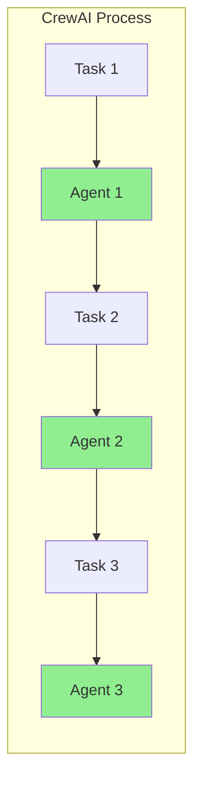

# ADR 002: Agent Orchestration with CrewAI

## 1. Status

**Accepted** - Implemented in version 1.0.0

## 2. Context

CrewClaw needs a framework to manage multiple autonomous agents with defined roles, task coordination, and a thought-action-observation loop.

### Requirements

- Support for multiple agents with distinct roles.
- Sequential or hierarchical task coordination.
- Native ReAct loop with auto-correction.
- Shared memory between agents.

## 3. Decisions

### 3.1 Chosen Framework: CrewAI

| Alternative | Decision | Rationale |
|-------------|---------|---------------|
| **CrewAI** | ✅ Chosen | Native ReAct loop, multi-agent, memory management |
| LangChain Agent | ❌ Rejected | Requires manual loop implementation |
| AutoGen | ❌ Rejected | Focus on conversation, not autonomous execution |
| Custom (LangChain) | ❌ Rejected | Development time too high |

### 3.2 Agent Architecture

```python
# Agent structure via Factory
Agent(
    role="explore",           # Agent role
    goal="Analyze code",      # Objective
    backstory="You are...",   # Context
    tools=[...],              # Available tools
    memory=Memory(...),       # Vector memory
    max_iter=20,              # Iteration limit
)
```

### 3.3 Execution Process



### 3.4 Process Types

| Type | Description | Usage |
|------|-----------|-----|
| **Sequential** | Tasks execute in order | Analysis pipeline |
| **Hierarchical** | Manager delegates subtasks | High complexity |

## 4. Implementation

### 4.1 Agent Factory

Location: `crewclaw/agents/factory.py`

```python
from crewclaw.agents.factory import AgentFactory

factory = AgentFactory()
agent = factory.create_agent(
    name="explorer",
    tools=[file_read, grep],
    memory=memory_instance
)
```

### 4.2 Crew Builder

Location: `crewclaw/agents/crew.py`

```python
from crewclaw.agents.crew import create_crew

crew = create_crew(
    agents=[agent1, agent2],
    tasks=[task1, task2],
    process=Process.sequential
)

result = crew.kickoff()
```

### 4.3 Agent Configuration

File: `config/agents.yaml`

```yaml
explorer:
  role: "Code Explorer"
  goal: "Find relevant code patterns"
  backstory: "Expert at analyzing codebases"
  tools:
    - file_read
    - grep
  verbose: true
  max_iter: 10
```

## 5. Consequences

### 5.1 Advantages

- **Native ReAct loop**: Thought → Action → Observation.
- **Multi-agent**: Automatic coordination.
- **Integrated Memory**: Shared memory between agents.
- **Tool calling**: Automatic integration with functions.

### 5.2 Limitations

- Dependency on the CrewAI ecosystem.
- Learning curve for YAML configuration.
- Less granular control vs pure LangChain.

## 6. References

- [CrewAI Documentation](https://docs.crewai.com/)
- [CrewAI GitHub](https://github.com/crewAIInc/crewAI)
