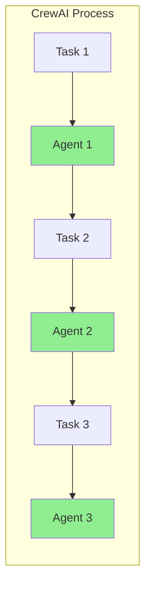

# ADR 002: Orquestração de Agentes com CrewAI

## 1. Status

**Aceito** - Implementado na versão 1.0.0

## 2. Contexto

O CrewClaw precisa de um framework para gerenciar múltiplos agentes autônomos com papéis definidos, coordenação de tarefas e loop de pensamento-ação-observação.

### Requisitos

- Suporte a múltiplos agentes com roles distintos
- Coordenação sequencial ou hierárquica de tarefas
- Loop ReAct nativo com auto-correção
- Memória compartilhada entre agentes

## 3. Decisões

### 3.1 Framework Escolhido: CrewAI

| Alternativa | Decisão | Justificativa |
|-------------|---------|---------------|
| **CrewAI** | ✅ Escolhido | Loop ReAct nativo, multi-agente, gestão de memória |
| LangChain Agent | ❌ Rejeitado | Requer implementação manual do loop |
| AutoGen | ❌ Rejeitado | Foco em conversação, não em execução autônoma |
| Custom (LangChain) | ❌ Rejeitado | Tempo de desenvolvimento muito alto |

### 3.2 Arquitetura de Agentes

```python
# Estrutura de agente via Factory
Agent(
    role="explore",           # Papél do agente
    goal="Analisar código",   # Objetivo
    backstory="Você é...",   # Contexto
    tools=[...],              # Ferramentas disponíveis
    memory=Memory(...),       # Memória vetorial
    max_iter=20,              # Limite de iterações
)
```

### 3.3 Processo de Execução



### 3.4 Tipos de Processo

| Tipo | Descrição | Uso |
|------|-----------|-----|
| **Sequential** | Tasks executam em ordem | Pipeline de análise |
| **Hierarchical** | Manager delega subtasks | Complexidade alta |

## 4. Implementação

### 4.1 Agent Factory

Local: `crewclaw/agents/factory.py`

```python
from crewclaw.agents.factory import AgentFactory

factory = AgentFactory()
agent = factory.create_agent(
    name="explorer",
    tools=[file_read, grep],
    memory=memory_instance
)
```

### 4.2 Crew Builder

Local: `crewclaw/agents/crew.py`

```python
from crewclaw.agents.crew import create_crew

crew = create_crew(
    agents=[agent1, agent2],
    tasks=[task1, task2],
    process=Process.sequential
)

result = crew.kickoff()
```

### 4.3 Configuração de Agentes

Arquivo: `config/agents.yaml`

```yaml
explorer:
  role: "Code Explorer"
  goal: "Find relevant code patterns"
  backstory: "Expert at analyzing codebases"
  tools:
    - file_read
    - grep
  verbose: true
  max_iter: 10
```

## 5. Consequências

### 5.1 Vantagens

- **Loop ReAct nativo**: Pensamento → Ação → Observação
- **Multi-agente**: Coordenação automática
- **Memória integrada**: Shared memory entre agentes
- **Tool calling**: Integração automática com funções

### 5.2 Limitações

- Dependência do ecossistema CrewAI
- Curva de aprendizado para configuração YAML
- Less granular control vs LangChain puro

## 6. Referências

- [CrewAI Documentation](https://docs.crewai.com/)
- [CrewAI GitHub](https://github.com/crewAIInc/crewAI)
