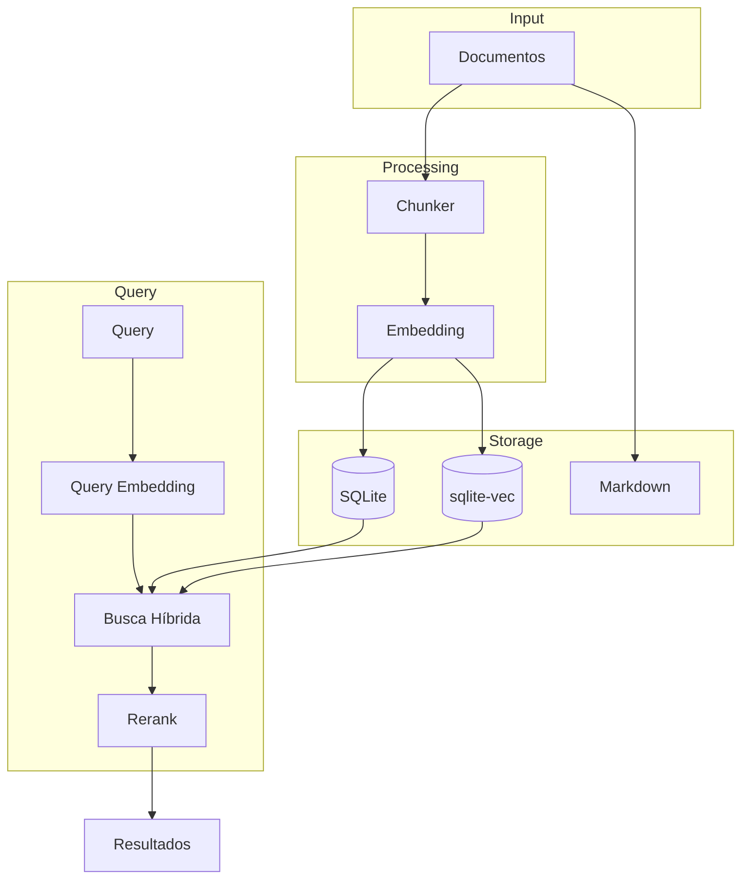
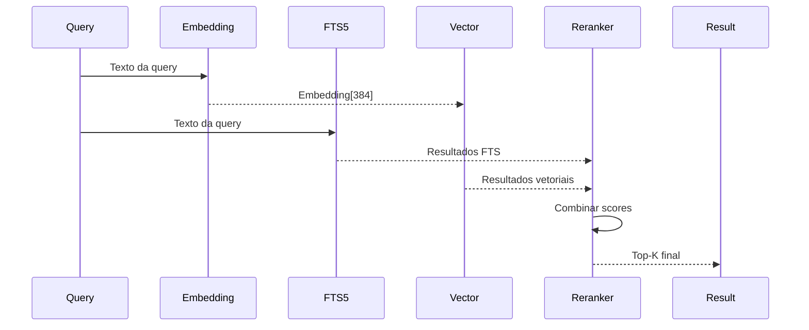

# ADR 003: Sistema de Memória Vetorial com SQLite-vec

## 1. Status

**Aceito** - Implementado na versão 1.0.0

## 2. Contexto

O CrewClaw precisa de um sistema de memória que permita:
- **Busca semântica**: Encontrar conceitos similares, não apenas palavras
- **Persistência local**: Zero dependência de serviços cloud
- **Busca híbrida**: Combinar SQL tradicional com vetores
- **Auditabilidade**: Arquivos Markdown legíveis por humanos

## 3. Decisões

### 3.1 Banco de Dados Vetorial

| Alternativa | Decisão | Justificativa |
|-------------|---------|---------------|
| **SQLite + sqlite-vec** | ✅ Escolhido | Local, arquivo único, rápido, híbrido |
| Qdrant | ❌ Rejeitado | Requer serviço externo |
| Pinecone | ❌ Rejeitado | Cloud-only |
| Chroma | ❌ Rejeitado | Menos maduro para production |
| FAISS | ❌ Rejeitado | Sem persistência nativa |

### 3.2 Arquitetura de Memória



### 3.3 Estrutura de Dados

#### Tabela de Documentos (SQL)

```sql
CREATE TABLE documents (
    id INTEGER PRIMARY KEY,
    scope TEXT NOT NULL,        -- /agent, /project, /company
    content TEXT NOT NULL,
    metadata JSON,
    created_at TIMESTAMP,
    updated_at TIMESTAMP
);
```

#### Tabela de Vetores (sqlite-vec)

```sql
CREATE TABLE vectors (
    id INTEGER PRIMARY KEY,
    document_id INTEGER REFERENCES documents(id),
    scope TEXT NOT NULL,
    chunk_text TEXT,
    embedding FLOAT[384]  -- sentence-transformers/all-MiniLM-L6-v2
);
```

### 3.4 Busca Híbrida



**Fórmula de scoring:**

```python
score = (1 - recency_weight) * semantic_score + recency_weight * recency_score
```

Configuração padrão:
- `recency_weight`: 0.3
- `default_limit`: 5
- `hybrid_rerank`: true

## 4. Scope de Memória

| Scope | Descrição | Retenção |
|-------|-----------|----------|
| `/agent` | Memória específica do agente | 30 dias |
| `/project` | Contexto do projeto | 90 dias |
| `/company` | Conhecimento organizacional | 180 dias |

## 5. Consolidação

### 5.1 Processo de RNN-like

```python
# Após N tarefas, o agente de consolidação:
1. Resume os eventos da sessão
2. Extrai pontos-chave
3. Atualiza o banco vetorial
4. Escreve no arquivo Markdown

# Simula hidden state de RNN:
# output(t) -> contexto para input(t+1)
```

### 5.2 Configuração

```json
{
  "memory": {
    "scopes": ["/agent", "/project", "/company"],
    "retention_days": 90,
    "auto_consolidate": true,
    "consolidate_after_tasks": 3
  }
}
```

## 6. Consequências

### 6.1 Vantagens

- **Local-first**: Zero cloud dependency
- **Híbrido**: SQL + vetor no mesmo DB
- **Auditável**: Sync com Markdown
- **Rápido**: SQLite é extremely performant

### 6.2 Limitações

- Requer extensão sqlite-vec compilada
- Embedding local mais lento que API
- Não é distribuído/multi-node

## 7. Referências

- [sqlite-vec Documentation](https://github.com/asg017/sqlite-vec)
- [Sentence-Transformers](https://sbert.net/)
- [Hybrid Search Best Practices](https://www.mongodb.com/blog/post/hybrid-search)
