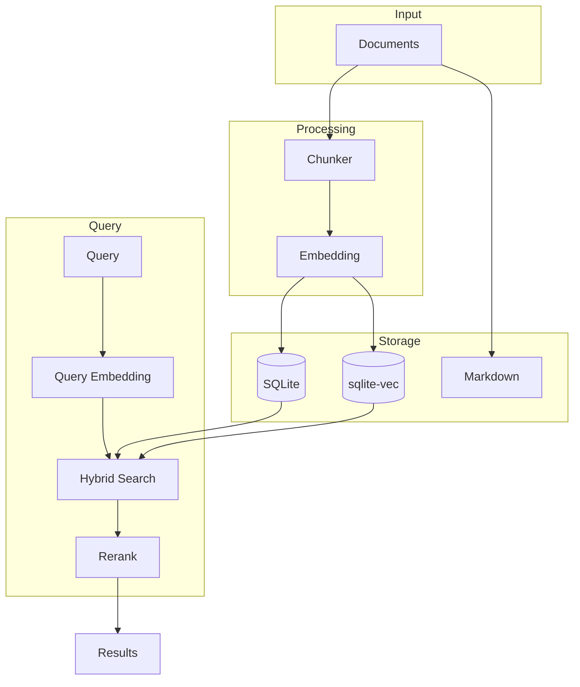
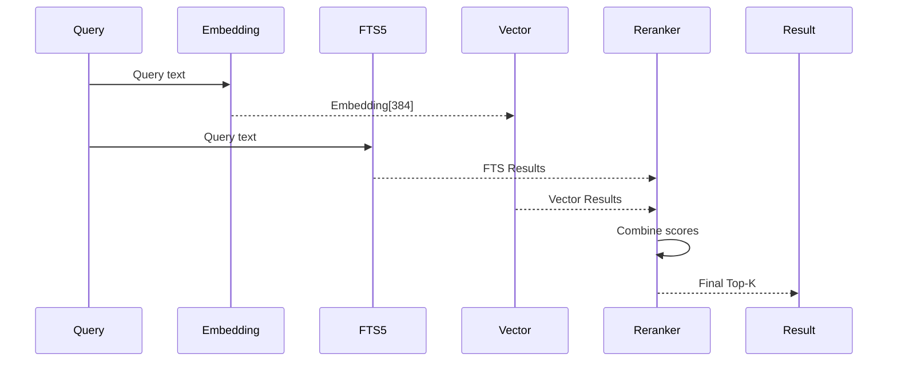

# ADR 003: Vector Memory System with SQLite-vec

## 1. Status

**Accepted** - Implemented in version 1.0.0

## 2. Context

CrewClaw needs a memory system that allows:
- **Semantic Search**: Finding similar concepts, not just words.
- **Local Persistence**: Zero cloud service dependency.
- **Hybrid Search**: Combining traditional SQL with vectors.
- **Auditability**: Human-readable Markdown files.

## 3. Decisions

### 3.1 Vector Database

| Alternative | Decision | Rationale |
|-------------|---------|---------------|
| **SQLite + sqlite-vec** | ✅ Chosen | Local, single file, fast, hybrid |
| Qdrant | ❌ Rejected | Requires external service |
| Pinecone | ❌ Rejected | Cloud-only |
| Chroma | ❌ Rejected | Less mature for production |
| FAISS | ❌ Rejected | No native persistence |

### 3.2 Memory Architecture



### 3.3 Data Structure

#### Document Table (SQL)

```sql
CREATE TABLE documents (
    id INTEGER PRIMARY KEY,
    scope TEXT NOT NULL,        -- /agent, /project, /company
    content TEXT NOT NULL,
    metadata JSON,
    created_at TIMESTAMP,
    updated_at TIMESTAMP
);
```

#### Vector Table (sqlite-vec)

```sql
CREATE TABLE vectors (
    id INTEGER PRIMARY KEY,
    document_id INTEGER REFERENCES documents(id),
    scope TEXT NOT NULL,
    chunk_text TEXT,
    embedding FLOAT[384]  -- sentence-transformers/all-MiniLM-L6-v2
);
```

### 3.4 Hybrid Search



**Scoring formula:**

```python
score = (1 - recency_weight) * semantic_score + recency_weight * recency_score
```

Default configuration:
- `recency_weight`: 0.3
- `default_limit`: 5
- `hybrid_rerank`: true

## 4. Memory Scope

| Scope | Description | Retention |
|-------|-----------|----------|
| `/agent` | Agent-specific memory | 30 days |
| `/project` | Project context | 90 days |
| `/company` | Organizational knowledge | 180 days |

## 5. Consolidation

### 5.1 RNN-like Process

```python
# After N tasks, the consolidation agent:
1. Summarizes session events
2. Extracts key points
3. Updates the vector database
4. Writes to the Markdown file

# Simulates RNN hidden state:
# output(t) -> context for input(t+1)
```

### 5.2 Configuration

```json
{
  "memory": {
    "scopes": ["/agent", "/project", "/company"],
    "retention_days": 90,
    "auto_consolidate": true,
    "consolidate_after_tasks": 3
  }
}
```

## 6. Consequences

### 6.1 Advantages

- **Local-first**: Zero cloud dependency.
- **Hybrid**: SQL + vector in the same DB.
- **Auditable**: Sync with Markdown.
- **Fast**: SQLite is extremely performant.

### 6.2 Limitations

- Requires compiled sqlite-vec extension.
- Local embedding slower than API.
- Not distributed/multi-node.

## 7. References

- [sqlite-vec Documentation](https://github.com/asg017/sqlite-vec)
- [Sentence-Transformers](https://sbert.net/)
- [Hybrid Search Best Practices](https://www.mongodb.com/blog/post/hybrid-search)
