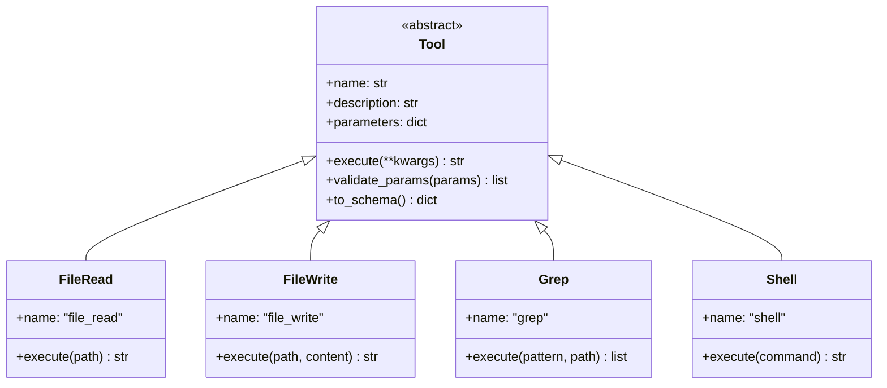

# ADR 004: Sistema de Ferramentas (Tools)

## 1. Status

**Aceito** - Implementado na versão 1.0.0

## 2. Contexto

Os agentes CrewClaw precisam de ferramentas para interagir com o sistema de arquivos, executar comandos, buscar na web e gerenciar memória.

### Requisitos

- Interface统一 para todas as tools
- Suporte a parâmetros com validação
- Execução assíncrona
- Schema OpenAI-compatible

## 3. Decisões

### 3.1 Arquitetura Base



### 3.2 Ferramentas Disponíveis

| Tool | Descrição | Parâmetros |
|------|-----------|------------|
| `file_read` | Ler arquivos | `path`, `limit`, `offset` |
| `file_write` | Escrever arquivos | `path`, `content` |
| `file_search` | Buscar por padrões | `pattern`, `path` |
| `grep` | Grep com regex | `pattern`, `include`, `path` |
| `shell` | Executar comandos | `command`, `timeout` |
| `web` | Busca na web | `query`, `num_results` |
| `directory_list` | Listar diretórios | `path`, `recursive` |
| `memory_search` | Buscar na memória | `query`, `scope`, `limit` |
| `crewai_tools` | Ferramentas externas | Múltiplas |

### 3.3 Schema de Parâmetros

Todas as tools seguem JSON Schema:

```python
{
    "type": "object",
    "properties": {
        "path": {
            "type": "string",
            "description": "Caminho do arquivo"
        }
    },
    "required": ["path"]
}
```

### 3.4 Integração com CrewAI

```python
from crewai import Agent
from crewclaw.tools import file_read, file_write

agent = Agent(
    tools=[file_read, file_write],
    ...
)
```

## 4. Implementação

### 4.1 Base Tool

Local: `crewclaw/tools/base.py`

```python
from crewclaw.tools.base import Tool

class FileReadTool(Tool):
    @property
    def name(self) -> str:
        return "file_read"
    
    @property
    def description(self) -> str:
        return "Read file contents"
    
    @property
    def parameters(self) -> dict:
        return {
            "type": "object",
            "properties": {
                "path": {"type": "string"},
                "limit": {"type": "integer"},
                "offset": {"type": "integer"}
            },
            "required": ["path"]
        }
    
    async def execute(self, **kwargs) -> str:
        # Implementation
        pass
```

### 4.2 Validação

```python
tool = FileReadTool()
errors = tool.validate_params({"path": "/test.txt"})
# [] = válido, ["error1", "error2"] = inválido
```

### 4.3 Schema OpenAI

```python
schema = tool.to_schema()
# {
#   "type": "function",
#   "function": {
#     "name": "file_read",
#     "description": "...",
#     "parameters": {...}
#   }
# }
```

## 5. Configuração

### 5.1 Em agents.yaml

```yaml
explorer:
  role: "Code Explorer"
  tools:
    - file_read
    - grep
    - directory_list
```

### 5.2 Tool Customizada

```python
from crewai_tools import import_tool

tool = import_tool("wikipedia_search")
```

## 6. Consequências

### 6.1 Vantagens

- **Interface统一**: Base class padrão
- **Type-safe**: Validação de schema
- **CrewAI compatible**: Integração automática
- **Extensível**: Easy to add new tools

### 6.2 Limitações

- Execução síncrona requer wrapper async
- Sem built-in rate limiting
- Error handling deve ser manual

## 7. Referências

- [CrewAI Tools](https://docs.crewai.com/core-concepts/tools/)
- [JSON Schema](https://json-schema.org/)
- [OpenAI Function Calling](https://platform.openai.com/docs/guides/function-calling)
