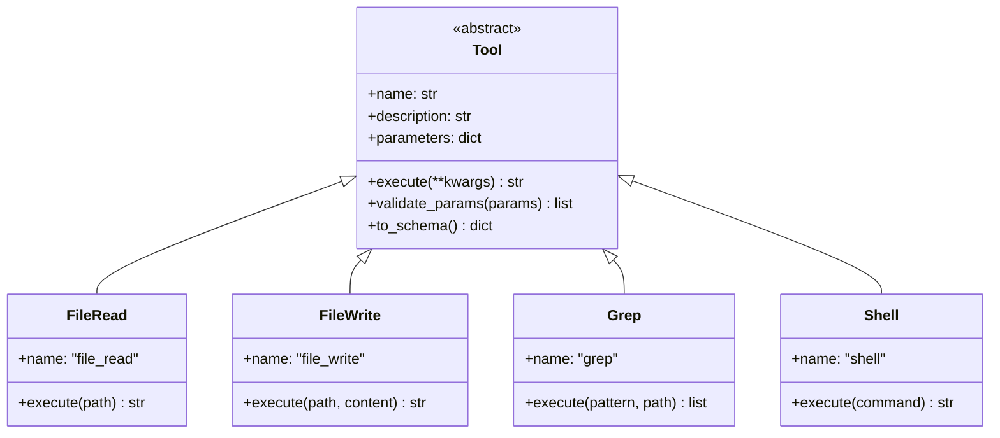

# ADR 004: Tools System

## 1. Status

**Accepted** - Implemented in version 1.0.0

## 2. Context

CrewClaw agents need tools to interact with the file system, execute commands, search the web, and manage memory.

### Requirements

- Unified interface for all tools.
- Support for parameters with validation.
- Asynchronous execution.
- OpenAI-compatible schema.

## 3. Decisions

### 3.1 Base Architecture



### 3.2 Available Tools

| Tool | Description | Parameters |
|------|-----------|------------|
| `file_read` | Read files | `path`, `limit`, `offset` |
| `file_write` | Write files | `path`, `content` |
| `file_search` | Search for patterns | `pattern`, `path` |
| `grep` | Grep with regex | `pattern`, `include`, `path` |
| `shell` | Execute commands | `command`, `timeout` |
| `web` | Web search | `query`, `num_results` |
| `directory_list` | List directories | `path`, `recursive` |
| `memory_search` | Search in memory | `query`, `scope`, `limit` |
| `crewai_tools` | External tools | Multiple |

### 3.3 Parameter Schema

All tools follow JSON Schema:

```python
{
    "type": "object",
    "properties": {
        "path": {
            "type": "string",
            "description": "File path"
        }
    },
    "required": ["path"]
}
```

### 3.4 Integration with CrewAI

```python
from crewai import Agent
from crewclaw.tools import file_read, file_write
-
agent = Agent(
    tools=[file_read, file_write],
    ...
)
```

## 4. Implementation

### 4.1 Base Tool

Location: `crewclaw/tools/base.py`

```python
from crewclaw.tools.base import Tool

class FileReadTool(Tool):
    @property
    def name(self) -> str:
        return "file_read"
    
    @property
    def description(self) -> str:
        return "Read file contents"
    
    @property
    def parameters(self) -> dict:
        return {
            "type": "object",
            "properties": {
                "path": {"type": "string"},
                "limit": {"type": "integer"},
                "offset": {"type": "integer"}
            },
            "required": ["path"]
        }
    
    async def execute(self, **kwargs) -> str:
        # Implementation
        pass
```

### 4.2 Validation

```python
tool = FileReadTool()
errors = tool.validate_params({"path": "/test.txt"})
# [] = valid, ["error1", "error2"] = invalid
```

### 4.3 OpenAI Schema

```python
schema = tool.to_schema()
# {
#   "type": "function",
#   "function": {
#     "name": "file_read",
#     "description": "...",
#     "parameters": {...}
#   }
# }
```

## 5. Configuration

### 5.1 In agents.yaml

```yaml
explorer:
  role: "Code Explorer"
  tools:
    - file_read
    - grep
    - directory_list
```

### 5.2 Custom Tool

```python
from crewai_tools import import_tool

tool = import_tool("wikipedia_search")
```

## 6. Consequences

### 6.1 Advantages

- **Unified Interface**: Standard base class.
- **Type-safe**: Schema validation.
- **CrewAI compatible**: Automatic integration.
- **Extensible**: Easy to add new tools.

### 6.2 Limitations

- Synchronous execution requires async wrapper.
- No built-in rate limiting.
- Error handling must be manual.

## 7. References

- [CrewAI Tools](https://docs.crewai.com/core-concepts/tools/)
- [JSON Schema](https://json-schema.org/)
- [OpenAI Function Calling](https://platform.openai.com/docs/guides/function-calling)
