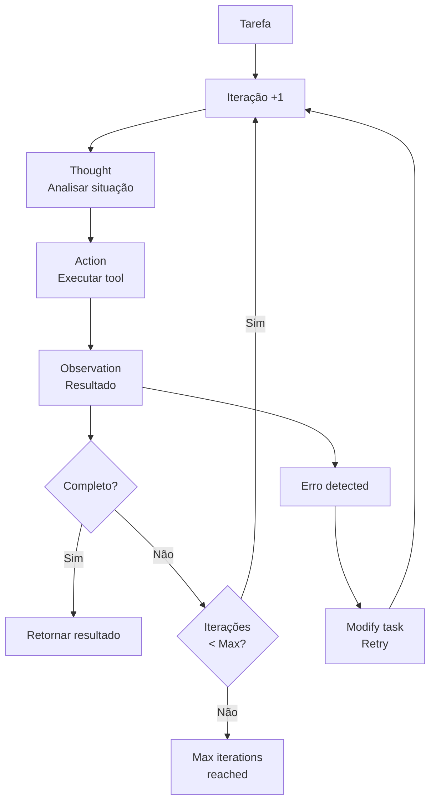
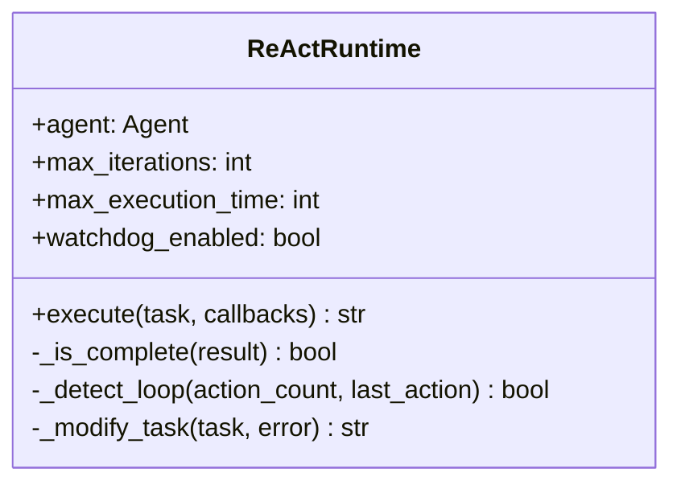

# ADR 005: Runtime ReAct - Execução Autônoma

## 1. Status

**Aceito** - Implementado na versão 1.0.0

## 2. Contexto

O CrewClaw precisa de um runtime que execute agentes de forma autônoma com:
- **Loop ReAct**: Thought → Action → Observation
- **Limite de iterações**: Evitar loops infinitos
- **Watchdog**: Detectar comportamento repetitivo
- **Auto-correção**: Recover de erros automaticamente

## 3. Decisões

### 3.1 Runtime Escolhido: Custom ReAct

| Abordagem | Decisão | Justificativa |
|-----------|---------|---------------|
| **Custom ReAct** | ✅ Escolhido | Control total, watchdog, callbacks |
| CrewAI native | ❌ Rejeitado | Less control sobre iterações |
| LangChain Agent | ❌ Rejeitado | Não suporta watchdog |

### 3.2 Fluxo ReAct



### 3.3 Componentes do Runtime



## 4. Configuração

### 4.1 Parâmetros

```json
{
  "runtime": {
    "max_iterations": 20,
    "max_execution_time": 300,
    "max_retry_limit": 2,
    "code_execution_mode": "safe",
    "watchdog_enabled": true,
    "watchdog_threshold": 3
  }
}
```

| Parâmetro | Default | Descrição |
|-----------|---------|-----------|
| `max_iterations` | 20 | Limite de loops ReAct |
| `max_execution_time` | 300s | Timeout total |
| `max_retry_limit` | 2 | Tentativas por erro |
| `watchdog_enabled` | true | Detectar loops |
| `watchdog_threshold` | 3 | Ações repetidas para trigger |

### 4.2 Uso

```python
from crewclaw.runtime.react import ReActRuntime
from crewclaw.agents.factory import AgentFactory

# Criar agente
factory = AgentFactory()
agent = factory.create_agent("explorer", tools=[...])

# Executar com runtime
runtime = ReActRuntime(agent)
result = runtime.execute(
    task="Analise o código fonte e encontre bugs",
    callbacks=[on_iteration, on_complete]
)
```

## 5. Mecanismos de Proteção

### 5.1 Watchdog

```python
def _detect_loop(self, action_count, last_action):
    """Detecta se agente está em loop."""
    if last_action in action_count:
        action_count[last_action] += 1
        return action_count[last_action] >= self.watchdog_threshold
    
    action_count[last_action] = 1
    return False

# Se watchdog dispara:
# RuntimeError: "Watchdog detected potential infinite loop"
```

### 5.2 Auto-correção

```python
def _modify_task(self, task, error):
    """Modifica task após erro para retry."""
    return f"""{task}
    
Note: Previous attempt failed with error: {error}. 
Please try a different approach."""
```

### 5.3 Completion Detection

```python
def _is_complete(self, result):
    """Verifica se resultado indica conclusão."""
    indicators = [
        "completed", "finished", "done",
        "success", "result:"
    ]
    return any(i in result.lower() for i in indicators)
```

## 6.Callbacks

### 6.1 Hooks de Execução

```python
def on_iteration(iteration, history):
    print(f"Iteration {iteration}")
    print(f"History: {history}")

def on_complete(result):
    print(f"Complete: {result}")

runtime.execute(
    task="...",
    callbacks=[on_iteration, on_complete]
)
```

## 7. Consequências

### 7.1 Vantagens

- **Controle total**: Iterações, timeouts, retries
- **Watchdog**: Previne loops infinitos
- **Callbacks**: Hooks para monitoring
- **Auto-correção**: Recovery automático

### 7.2 Limitações

- Implementação custom requer manutenção
- Less polished que CrewAI native
- Timeout em segundos, não granular

## 8. Referências

- [ReAct: Synergizing Reasoning and Acting in Language Models](https://arxiv.org/abs/2210.03629)
- [LangChain Agents](https://python.langchain.com/docs/modules/agents/)
- [CrewAI Process](https://docs.crewai.com/core-concepts/processes/)
