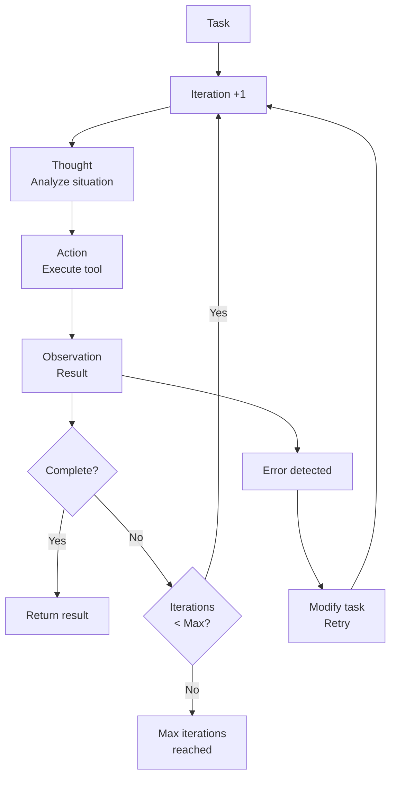
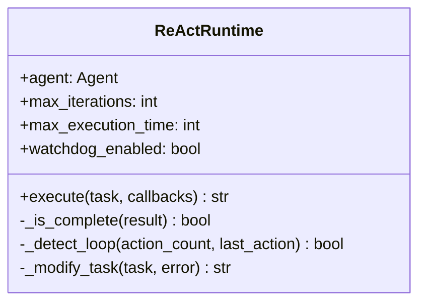

# ADR 005: ReAct Runtime - Autonomous Execution

## 1. Status

**Accepted** - Implemented in version 1.0.0

## 2. Context

CrewClaw needs a runtime that executes agents autonomously with:
- **ReAct Loop**: Thought → Action → Observation.
- **Iteration Limit**: Avoid infinite loops.
- **Watchdog**: Detect repetitive behavior.
- **Auto-correction**: Automatically recover from errors.

## 3. Decisions

### 3.1 Chosen Runtime: Custom ReAct

| Approach | Decision | Rationale |
|-----------|---------|---------------|
| **Custom ReAct** | ✅ Chosen | Full control, watchdog, callbacks |
| CrewAI native | ❌ Rejected | Less control over iterations |
| LangChain Agent | ❌ Rejected | Does not support watchdog |

### 3.2 ReAct Flow



### 3.3 Runtime Components



## 4. Configuration

### 4.1 Parameters

```json
{
  "runtime": {
    "max_iterations": 20,
    "max_execution_time": 300,
    "max_retry_limit": 2,
    "code_execution_mode": "safe",
    "watchdog_enabled": true,
    "watchdog_threshold": 3
  }
}
```

| Parameter | Default | Description |
|-----------|---------|-----------|
| `max_iterations` | 20 | ReAct loop limit |
| `max_execution_time` | 300s | Total timeout |
| `max_retry_limit` | 2 | Attempts per error |
| `watchdog_enabled` | true | Detect loops |
| `watchdog_threshold` | 3 | Repeated actions for trigger |

### 4.2 Usage

```python
from crewclaw.runtime.react import ReActRuntime
from crewclaw.agents.factory import AgentFactory

# Create agent
factory = AgentFactory()
agent = factory.create_agent("explorer", tools=[...])

# Execute with runtime
runtime = ReActRuntime(agent)
result = runtime.execute(
    task="Analyze the source code and find bugs",
    callbacks=[on_iteration, on_complete]
)
```

## 5. Protection Mechanisms

### 5.1 Watchdog

```python
def _detect_loop(self, action_count, last_action):
    """Detects if agent is in a loop."""
    if last_action in action_count:
        action_count[last_action] += 1
        return action_count[last_action] >= self.watchdog_threshold
    
    action_count[last_action] = 1
    return False

# If watchdog triggers:
# RuntimeError: "Watchdog detected potential infinite loop"
```

### 5.2 Auto-correction

```python
def _modify_task(self, task, error):
    """Modifies task after error for retry."""
    return f"""{task}
    
Note: Previous attempt failed with error: {error}. 
Please try a different approach."""
```

### 5.3 Completion Detection

```python
def _is_complete(self, result):
    """Checks if result indicates completion."""
    indicators = [
        "completed", "finished", "done",
        "success", "result:"
    ]
    return any(i in result.lower() for i in indicators)
```

## 6. Callbacks

### 6.1 Execution Hooks

```python
def on_iteration(iteration, history):
    print(f"Iteration {iteration}")
    print(f"History: {history}")

def on_complete(result):
    print(f"Complete: {result}")

runtime.execute(
    task="...",
    callbacks=[on_iteration, on_complete]
)
```

## 7. Consequences

### 7.1 Advantages

- **Full Control**: Iterations, timeouts, retries.
- **Watchdog**: Prevents infinite loops.
- **Callbacks**: Hooks for monitoring.
- **Auto-correction**: Automatic recovery.

### 7.2 Limitations

- Custom implementation requires maintenance.
- Less polished than native CrewAI.
- Timeout in seconds, not granular.

## 8. References

- [ReAct: Synergizing Reasoning and Acting in Language Models](https://arxiv.org/abs/2210.03629)
- [LangChain Agents](https://python.langchain.com/docs/modules/agents/)
- [CrewAI Process](https://docs.crewai.com/core-concepts/processes/)
