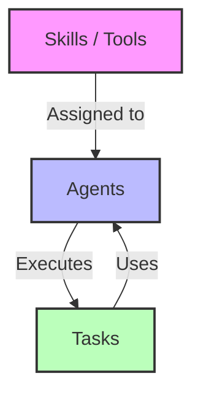
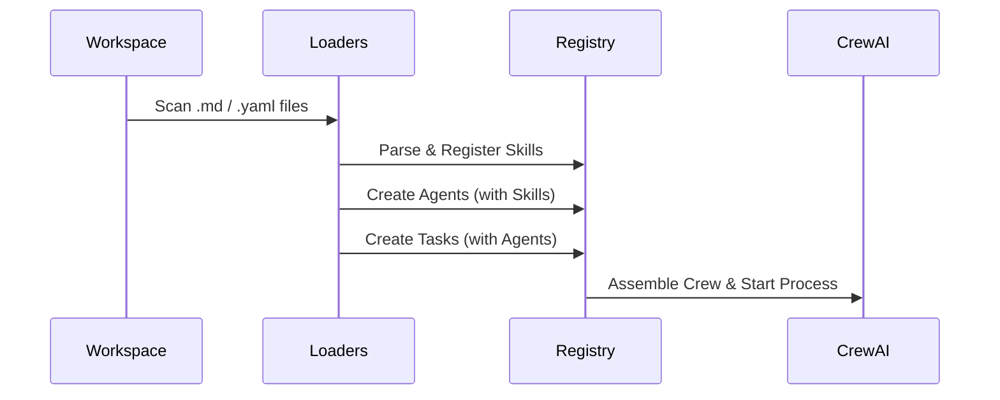

# Skills, Agents, and Tasks: The CrewClaw Triad

The core of CrewClaw's orchestration is the interaction between three dynamic components: **Skills**, **Agents**, and **Tasks**.

## The Triad Components

### 1. Skills
Skills are the "hands" of your agents. They are tools that an agent can call to perform specific actions (e.g., search the web, write to a file, check the weather).
- **Location**: `workspace/skills/*.md`
- **Definition**: A Markdown file with YAML frontmatter for metadata and a Python code block with an `execute()` function.

### 2. Agents
Agents are the "workers". Each agent has a specific role, goal, and backstory. They consume Skills to achieve their goals.
- **Location**: `workspace/agents/*.yaml` or `*.md`
- **Definition**: Specifies the agent's persona and a list of `tools` (skills) it can use.
- **Initialization**: While you can write them from scratch, CrewClaw provides **Templates** (Assistant, Researcher, SRE, etc.) that are automatically injected into your workspace during `crewclaw init` based on your objective.

### 3. Tasks
Tasks are the "assignments". They define what needs to be done, the expected output, and which agent is responsible for it.
- **Location**: `workspace/tasks/*.yaml` or `*.md`
- **Definition**: Describes the mission and links it to a specific `agent`.

---

## Dynamic Loading Process

CrewClaw scans the workspace and dynamically assembles the Crew based on your definitions.

### How to add a new Agent
1. Create a file `workspace/agents/researcher.yaml`.
2. Define the `role`, `goal`, `backstory`, and `tools`.
3. Create a task in `workspace/tasks/research_task.yaml` and assign it to `researcher`.
4. Run CrewClaw!
