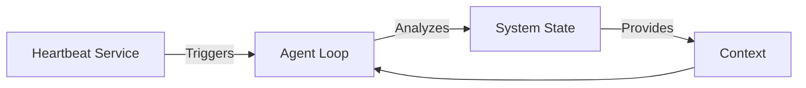
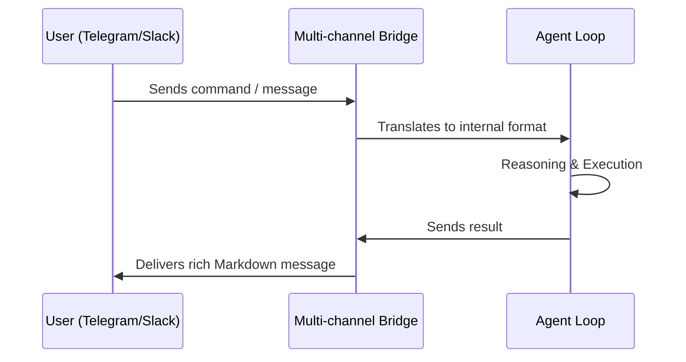

# CrewClaw Advanced Modules

This guide covers the advanced features that make CrewClaw a proactive and evolvable agentic system.

---

## 1. Soul & Personality Evolution
Allows the agent to develop a persistent and evolving identity.

### The `soul.md`
Stored in the workspace, it defines the agent's essence:
- **Identity**: Name, Purpose, Voice.
- **Values**: Safety constraints and behavioral guidelines.
- **Memory of Ego**: Log of fundamental learnings and refinements.

### Mechanism
The "Soul" is injected into the System Prompt with high priority. The agent can suggest edits to its own `soul.md` based on experience.

---

## 2. Proactivity: Heartbeat & Scheduled Hooks
CrewClaw can act without direct user intervention.

### Heartbeat Scheduler
A background service that "wakes up" the Agent Loop at intervals.
- **Use Case**: Monitoring, daily standups, maintenance.
- **Diagram**:


### Scheduled Hooks
Atomic actions execute based on cron schedules without full reasoning loops.
- **Actions**: Webhooks (HTTP), Shell scripts, Logging, or specific Agent Tasks.

---

## 3. Multi-channel Messenger Bridge
Expands interaction beyond the terminal into Telegram, Slack, or WhatsApp.

### Telegram Configuration (Experimental)
Para configurar o Telegram, você precisará de um Token do BotFather:
1. Crie um bot no [@BotFather](https://t.me/botfather).
2. Adicione o Token ao seu arquivo `crewclaw.json` (quando disponível) ou como variável de ambiente:
   ```bash
   export TELEGRAM_BOT_TOKEN="seu_token_aqui"
   ```

> [!NOTE]
> O suporte nativo via CLI está em desenvolvimento. Atualmente, a implementação base encontra-se em `crewclaw/agent/bridge.py` como um placeholder para integração futura.

### Interaction Workflow


---

## 4. Self-Improvement Loop
The agent analyzes its own performance to suggest code or prompt improvements.

1.  **Analyze**: Reviews `logs/` for failures.
2.  **Plan**: Creates an internal `implementation_plan.md`.
3.  **Execute**: Applies fixes using `file_write` and `shell`.
4.  **Verify**: Runs `pytest` for regressions.

---

## 5. Modular Skill Registry
Enables adding new capabilities via declarative Markdown files.
- **Sharing**: Easy to share and reuse skills across different crews.
- **Dynamic**: Registered instantly without core code changes.
