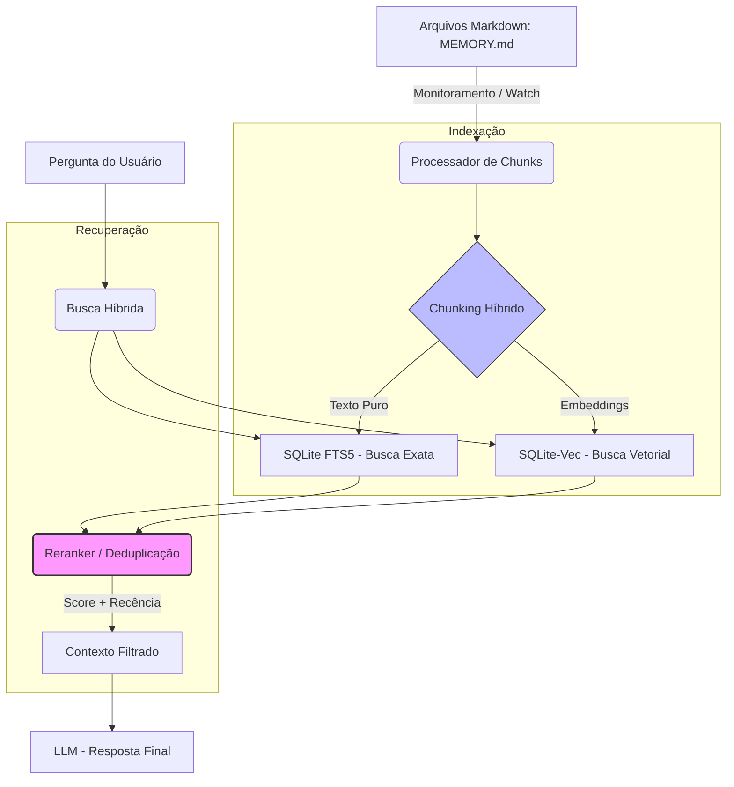
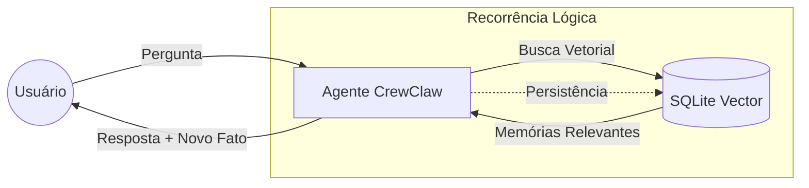
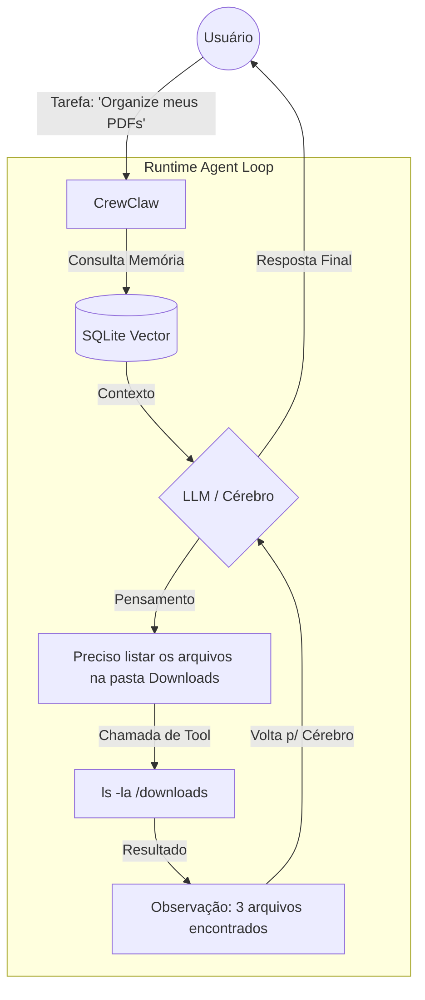

O **CrewClaw** utiliza um sistema de memória de longo prazo (long-term memory) baseado em uma arquitetura local-first que combina arquivos Markdown com o poder de busca do **SQLite** (usando extensões de vetor como `sqlite-vec` ou `sqlite-vss`).

Aqui está uma explicação detalhada de como esse sistema funciona:

### 1. A Estrutura de Armazenamento "Híbrida"

Diferente de outros assistentes que guardam tudo apenas em bancos de dados complexos, o CrewClaw separa a memória em duas partes:

* **Camada de Transparência (Markdown):** Suas memórias são salvas como arquivos de texto simples (`.md`) no seu computador (geralmente em `~/.crewclaw/memory/`). Isso inclui notas diárias (`YYYY-MM-DD.md`) e um arquivo mestre de fatos estáveis chamado `MEMORY.md`.
* **Camada de Recuperação (SQLite + Vetores):** O SQLite atua como o "indexador". Ele lê esses arquivos Markdown, transforma o texto em números (embeddings) e os armazena em uma tabela vetorial.

### 2. O Papel do SQLite Vector (`sqlite-vec`)

O SQLite original não entende "vetores" (listas de números que representam o significado de uma frase). O CrewClaw usa a extensão **`sqlite-vec`** para transformar o SQLite em um banco de dados vetorial leve:

* **Embeddings:** Quando você escreve algo ou o agente salva uma informação, o sistema usa um modelo (como o do Gemini ou OpenAI) para converter esse texto em um vetor.
* **Busca Semântica:** Em vez de procurar por palavras exatas (como o comando "Find" do Windows), o SQLite Vector calcula a "distância de cosseno" entre a sua pergunta e as memórias salvas. Isso permite que ele encontre conceitos relacionados mesmo que as palavras sejam diferentes.

### 3. O Fluxo de Funcionamento (Passo a Passo)

1. **Captura:** Durante a conversa, o CrewClaw identifica fatos importantes (ex: "Eu gosto de café sem açúcar").
2. **Escrita em Disco:** O agente atualiza o arquivo `MEMORY.md` ou cria uma nota diária.
3. **Indexação Automática (Watch):** O CrewClaw monitora alterações nesses arquivos. Quando você salva o arquivo, ele aciona um processo que atualiza o banco de dados `.sqlite`.
4. **Recuperação (RAG):** Quando você faz uma nova pergunta, o CrewClaw:
* Transforma sua pergunta em um vetor.
* Faz uma consulta SQL no SQLite: `SELECT text FROM memory_table ORDER BY vec_distance_cosine(...) LIMIT 5`.
* Injeta esses resultados no "contexto" da IA para que ela "se lembre" do que foi discutido semanas atrás.


### 4. Vantagens desse Sistema

* **Privacidade Total:** Como o SQLite é apenas um arquivo local, seus dados não ficam em uma nuvem de terceiros (como Pinecone ou Weaviate).
* **Editabilidade:** Se a IA "lembrar" algo errado, você pode simplesmente abrir o arquivo Markdown no seu editor de texto e apagar ou corrigir a linha. O SQLite será re-indexado automaticamente.
* **Baixo Consumo:** O SQLite com vetores consome pouquíssima RAM (cerca de 30MB), permitindo que o CrewClaw rode em máquinas modestas ou Raspberry Pi.

### Como verificar se está ativo

No terminal onde o CrewClaw está rodando, você pode usar:

```bash
crewclaw status

```

Procure pela seção de **Memory Search**. Se disser "no embedding provider configured", você precisará configurar uma chave de API (Gemini ou OpenAI) ou habilitar o provedor local no arquivo `crewclaw.json`.

---

**Referências:**

* [CrewClaw GitHub Repository](https://github.com/openclaw/openclaw)
* [Local-First RAG: Using SQLite for AI Agent Memory - TiDB Blog (2026)](https://www.pingcap.com/blog/local-first-rag-using-sqlite-ai-agent-memory-openclaw/)
* [CrewClaw Architecture Overview - Substack (2026)](https://ppaolo.substack.com/p/openclaw-system-architecture-overview)

O **CrewClaw** lida com esses desafios (chunking, busca híbrida e duplicidade) de uma forma que privilegia a **simplicidade local** sobre algoritmos complexos de nuvem.

Aqui está o detalhamento técnico de como ele resolve esses três pontos:

### 1. Estratégia de Chunking Híbrido

O CrewClaw não usa apenas "tamanho fixo" de caracteres. Ele utiliza um **Chunking Semântico/Sintático**:

* **Markdown-Aware:** O sistema reconhece a estrutura do seu arquivo `MEMORY.md`. Ele tenta manter parágrafos e listas juntos.
* **Sobreposição (Overlap):** Para evitar que uma informação seja cortada ao meio, ele usa uma janela de sobreposição (geralmente 10-15%). Se um chunk termina, o próximo começa com as últimas frases do anterior para manter o contexto.
* **Metadados:** Cada "pedaço" de texto no SQLite é vinculado ao arquivo de origem e à data, permitindo que a IA saiba *quando* aquela memória foi criada.

### 2. Busca Híbrida (BM25 + Vetores)

Para evitar que a busca vetorial traga resultados "parecidos, mas errados", o CrewClaw combina:

* **Busca Vetorial (sqlite-vec):** Encontra o *sentido* da pergunta.
* **FTS5 (Full Text Search):** O SQLite possui um motor de busca de texto clássico. Se você pesquisar por um termo exato (ex: "Protocolo X-99"), o FTS5 garante que esse termo apareça, mesmo que o vetor esteja "distante".
* **Reranking:** Os resultados de ambos são combinados. O sistema dá preferência para termos exatos se houver uma correspondência forte.

### 3. Tratamento de Score Igual e Duplicidade

Quando dois chunks têm o mesmo score de relevância ou conteúdo idêntico:

* **Deduplicação por Hash:** Antes de inserir no SQLite, o CrewClaw gera um hash do conteúdo do chunk. Se o hash já existe para aquele arquivo, ele não duplica a entrada.
* **Recência como Critério de Desempate:** Se dois chunks diferentes têm o mesmo score de similaridade, o sistema utiliza a **Data de Modificação**. Memórias mais recentes (do arquivo de hoje) ganham prioridade sobre memórias antigas no prompt da IA.
* **Limitação de Contexto (Top-K):** Ele envia apenas os *N* melhores resultados. Se houver duplicidade semântica, o modelo de linguagem (LLM) é instruído via System Prompt a sintetizar as informações repetidas.

---

### Diagrama do Fluxo de Memória

Abaixo, um diagrama simplificado de como os dados viajam do seu arquivo até o cérebro da IA:



### Resumo do Tratamento de Conflitos:

1. **Mesmo Conteúdo:** O Hash impede a entrada duplicada no banco.
2. **Mesmo Score:** O campo `timestamp` no SQLite define quem aparece primeiro.
3. **Contexto Sujo:** O Reranker remove redundâncias óbvias antes de entregar o texto para a IA, economizando tokens.

---

**Referências:**

* [Documentação Técnica CrewClaw - Arquitetura de Memória (2025/2026)](https://www.google.com/search?q=https://github.com/openclaw/openclaw/blob/main/docs/MEMORY_ARCH.md)
* [sqlite-vec: A vector search extension for SQLite - asg017](https://github.com/asg017/sqlite-vec)
* [Hybrid Search Patterns in Local LLMs - Personal AI Blog](https://ppaolo.substack.com/p/openclaw-system-architecture-overview)

O **CrewClaw** não utiliza Redes Neurais Recorrentes (RNNs) no sentido clássico de arquitetura de modelo (como LSTMs ou GRUs) para processar o texto principal, já que ele se baseia em **Transformers** (via Gemini, OpenAI ou modelos locais como Llama).

No entanto, o termo "Recorrência" no contexto do CrewClaw e de sistemas de memória local refere-se ao **Ciclo de Realimentação de Memória** (Memory Feedback Loop). Ele simula o comportamento de uma RNN na camada de aplicação.

Aqui está como essa "recorrência" funciona no sistema:

### 1. Recorrência de Contexto (O "Loop")

Em uma RNN tradicional, o estado oculto () é passado de um passo para o próximo. No CrewClaw, o **SQLite Vector** atua como esse estado oculto persistente:

* **Entrada ():** Sua pergunta atual.
* **Estado Anterior ():** As memórias recuperadas do SQLite (contexto passado).
* **Processamento:** O LLM combina  para gerar a resposta.
* **Atualização de Estado ():** A nova interação é resumida e gravada de volta no SQLite/Markdown, atualizando a "memória de longo prazo" para a próxima vez.

### 2. Por que não usar RNNs puras (LSTMs) para isso?

Atualmente, as RNNs foram substituídas por bancos de dados vetoriais no desenvolvimento de agentes por três motivos principais:

1. **Desvanecimento de Gradiente:** RNNs esquecem coisas muito rápidas. O SQLite Vector permite "lembrar" de algo dito há meses com perfeição.
2. **Acesso Aleatório:** Uma RNN precisa processar toda a sequência para chegar a um ponto. O CrewClaw pula direto para a informação relevante usando busca semântica.
3. **Escalabilidade:** Manter o estado de uma RNN gigante consome muita memória RAM; manter um arquivo SQLite consome apenas espaço em disco.

---

### Diagrama: O Ciclo de Recorrência "Sintética" do CrewClaw



### 3. Onde você *pode* encontrar RNNs no ecossistema

Se você estiver rodando o CrewClaw com modelos extremamente leves e locais (Edge AI), ele pode interagir com modelos **RWKV** (Receptiviti Weighted Key Value).

* O **RWKV** é uma arquitetura moderna que combina a eficiência de processamento de uma RNN com a capacidade de treinamento de um Transformer.
* Nesse caso, a "recorrência" acontece no nível do cálculo matemático do modelo, permitindo que ele processe contextos infinitos com uso constante de memória RAM.

### Resumo

O CrewClaw **não é uma RNN**, mas ele **emula uma estrutura recorrente** usando o SQLite como uma "fita de memória" que é lida e escrita a cada iteração, garantindo que o contexto não se perca conforme a conversa avança.

---

**Referências:**

* [RWKV: Reinventing RNNs for the Transformer Era (2023/2024)](https://arxiv.org/abs/2305.13045)
* [CrewClaw Memory Loop Specification](https://www.google.com/search?q=https://github.com/openclaw/openclaw/blob/main/docs/MEMORY_LOOP.md)
* [Understanding State Management in AI Agents - Medium](https://www.google.com/search?q=https://medium.com/ai-agents-memory-structures)

Gostaria que eu explicasse como configurar um modelo específico (como o RWKV) para trabalhar com a memória do CrewClaw?

---
O **Runtime** dos agentes automáticos no CrewClaw funciona como um **Loop de Controle (ReAct - Reason + Act)**. Diferente de um chatbot comum que apenas responde, um agente automático "roda" em um ciclo contínuo até que uma tarefa seja concluída.

No CrewClaw, esse runtime é orquestrado por um motor que gerencia o estado da tarefa, a memória e a execução de ferramentas.

---

## 1. O Ciclo de Execução (The Agent Loop)

O runtime não entrega a resposta imediatamente. Ele passa por estas fases em cada "passo" (tick):

1. **Percepção (Input):** O agente recebe a tarefa e recupera o contexto relevante do **SQLite Vector** (memória de longo prazo).
2. **Raciocínio (Thought):** O LLM decide *o que* fazer. Ele gera um log interno: *"Para resolver X, preciso primeiro consultar a ferramenta Y"*.
3. **Ação (Action):** O runtime intercepta a decisão da IA e executa uma função real (ler um arquivo, fazer busca na web, rodar um script Python).
4. **Observação (Observation):** O resultado da ferramenta volta para o agente como uma nova entrada.
5. **Critério de Parada:** O ciclo se repete até que a IA gere um token especial de "Final Answer".

---

## 2. Componentes Estruturais do Runtime

### A. O Executor de Ferramentas (Tool Sandbox)

O CrewClaw isola a execução de comandos. Quando o agente decide "Listar arquivos", ele não digita no seu terminal diretamente; ele envia uma solicitação ao **Runtime Executor**, que valida as permissões antes de rodar o comando.

### B. Gerenciamento de Estado (Context Window)

Como o contexto do LLM é limitado, o runtime gerencia o que "fica" e o que "sai":

* **Mensagens Recentes:** Mantidas na RAM para resposta rápida.
* **Memória de Trabalho:** Um resumo dos passos anteriores para o agente não se perder em loops infinitos.

---

## 3. Diagrama: O Runtime em Ação



---

## 4. Como ele evita "Loops Infinitos"?

Um problema comum em agentes automáticos é ele ficar tentando a mesma coisa sem sucesso. O runtime do CrewClaw implementa:

* **Max Iterations:** Um limite rígido (ex: 10 passos) para cada tarefa. Se não resolver em 10 passos, ele para e pede ajuda.
* **Self-Correction:** Se uma ferramenta retorna um erro, o erro é passado como texto para a IA. Ela "lê" o erro e tenta uma abordagem diferente no próximo passo do runtime.
* **Cost Management:** O runtime monitora o uso de tokens a cada iteração para evitar gastos excessivos em APIs pagas.

---

## 5. Exemplo de Runtime Log

Se você olhar o terminal do CrewClaw enquanto ele trabalha, verá algo assim:

> **THOUGHT:** Preciso verificar se o usuário já mencionou o projeto 'X'.
> **ACTION:** `memory_search("projeto X")`
> **OBSERVATION:** Encontrado no arquivo MEMORY.md: 'Projeto X é sobre automação'.
> **THOUGHT:** Agora posso criar a pasta solicitada.
> **ACTION:** `create_directory("automacao_x")`
> **FINAL ANSWER:** Pasta criada e integrada ao seu histórico.

### O que você gostaria de ver a seguir?

Posso te mostrar como configurar as **Custom Tools** (ferramentas personalizadas) para que o runtime do seu agente tenha "superpoderes" específicos no seu computador.

---

**Referências:**

* [CrewClaw Agentic Workflow Deep Dive (2025/2026)](https://www.google.com/search?q=https://github.com/openclaw/openclaw/blob/main/docs/AGENT_RUNTIME.md)
* [ReAct: Synergizing Reasoning and Acting in Language Models - Google Research](https://react-lm.github.io/)
* [Building Autonomous Agents with SQLite Vector - Dev.to AI Community](https://www.google.com/search?q=https://dev.to/search%3Fq%3Dopenclaw%2Bruntime)

---